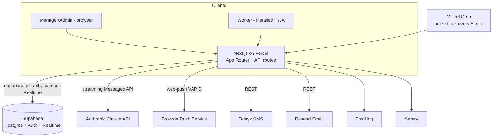

# PRD — Jiminee

## 1. Overview

### Product Summary

**Jiminee** (jiminee.work) — a Kanban task board where AI writes the instructions and a friendly conscience keeps workers on task. Managers post one-sentence task cards to a shared board; workers claim them and tap "Tell Me How" to get AI-generated, site-specific, checkable steps with a follow-up chat. Activity-based idle detection nudges stalled tasks by push/SMS, disputes get routed to a neutral Administrator, and everything lands in an audit log that doubles as the pilot's measurement instrument.

### Objective

This PRD covers the **.work Phase 1 MVP** as defined in `docs/product-vision.md` § Product Strategy → MVP Definition: org/auth/roles, real-time Kanban board, Tell Me How (steps + chat + correction flag), workplace brief, Tier 1 activity signals with nudges, minimal dispute workflow, disclosure/consent, gate-metric dashboard, and voice settings. Tier 2/3 monitoring, the .me product, instruction-memory retrieval, and payments are explicitly out of scope (§ 13).

### Market Differentiation

Jiminee must deliver two things no competitor combines: near-zero specification cost (one sentence in → a grounded, novice-proof checklist out) and near-zero verification cost (activity-based nudging that escalates only exceptions). Technically that means: Tell Me How generation must be grounded (workplace brief in every prompt), fast (streamed), and mobile-first (tappable checkboxes); and the nudge pipeline must run unattended (cron-driven idle detection → push → SMS fallback) with every event logged to `task_events` so the pilot gate is computable from data.

### Magic Moment

A manager types "restock the printer in Brackett 214"; thirty seconds later a student who has never done it follows nine site-specific steps — and when they stall, the cricket chirps before the manager has to. Implementation requirements: card creation in <30s with only a title required; step generation streams token-by-token (perceived latency <3s to first step); steps render as checkable items in the browser (desktop-first, phone PWA supported); the idle-check cron and push/SMS pipeline fire with no human in the loop.

### Success Criteria

- Full task lifecycle (create → claim → steps → checkoffs → done) works in a desktop browser (Chrome/Edge — workers are desktop-first on laptops) AND on a phone via installed PWA (secondary).
- Time from card creation to first streamed step < 5 seconds on campus Wi-Fi.
- A claimed task with no activity receives a browser push nudge within its idle window and an SMS within 15 minutes of an unanswered push, verified end-to-end with the browser minimized/locked.
- All P0 functional requirements implemented; the two gate metrics render on the dashboard without manual SQL.
- RLS verified: a user in org A can read nothing of org B (tested with two seeded orgs).
- Every lifecycle action produces exactly one `task_events` row (no gaps, no dupes).

## 2. Technical Architecture

### Architecture Overview



### Chosen Stack

| Layer | Choice | Rationale |
|---|---|---|
| Frontend | Next.js (TypeScript), Tailwind, dnd-kit, PWA-capable | Workers are desktop-first (laptops, office tasks) — desktop browser push needs no install; installable PWA supported for phone use (iOS requires home-screen install); dnd-kit for Kanban drag |
| Backend | Next.js API routes + Supabase | Supabase supplies Realtime board sync; Anthropic API for Tell Me How; Telnyx for SMS fallback; matches founder's existing stack |
| Database | Supabase Postgres | RLS enforces org tenancy; core tables per spec |
| Auth | Supabase Auth | Email/password + magic-link invites; roles on memberships |
| Payments | None | Pilot is free; Stripe post-gate (see § 10) |
| Analytics | PostHog | Free tier covers pilot; doubles as gate instrumentation |
| Email | Resend | Invites, dispute notifications, manager digests |
| Error tracking | Sentry | Non-technical founder needs errors surfaced, not reported by workers |

### Stack Integration Guide

**Setup order:**
1. `npx create-next-app@latest jiminee --typescript --tailwind --app --src-dir` (App Router, `src/` layout).
2. Create the Supabase project; run migrations (§ 3) via the Supabase CLI (`supabase init`, `supabase db push`); enable Realtime on `tasks`, `task_steps`, `disputes`.
3. Install `@supabase/supabase-js` and `@supabase/ssr`; wire the three-client pattern: browser client (anon key), server client (cookies via `@supabase/ssr`), admin client (service-role key, server-only, for cron/webhooks).
4. Add `@anthropic-ai/sdk`; create the `lib/ai/` provider seam (one module exports `generateSteps()` and `cardChat()`; nothing else imports the SDK directly).
5. PWA: use `serwist` (`@serwist/next`) for the service worker + `manifest.webmanifest`; implement push subscription with the `web-push` package (generate VAPID keys once: `npx web-push generate-vapid-keys`).
6. Telnyx (`telnyx` package, REST) for SMS fallback; Resend (`resend` package) for email; PostHog (`posthog-js`) client-side; Sentry via `@sentry/nextjs` wizard.
7. Vercel: connect repo, set env vars, add `vercel.json` cron entry for `/api/cron/idle-check` (`*/5 * * * *`).

**Gotchas specific to this combination:**
- iOS web push works **only** after the PWA is added to the home screen and permission is requested from a user gesture. Onboarding must sequence: install → open from home screen → tap "Enable reminders" → `Notification.requestPermission()`.
- Supabase Realtime postgres_changes respects RLS, but you must call `.subscribe()` after auth is hydrated or you silently get no events. Subscribe inside an effect keyed on the session.
- `@supabase/ssr` cookie handling: middleware must refresh the session (`updateSession` pattern from Supabase docs) or server components see stale auth.
- Anthropic streaming through a Next.js route handler: return the stream as an SSE `Response`; the client consumes via a stream reader. Persist steps to DB only after the stream completes (single transaction), then broadcast via Realtime.
- Vercel Cron requests are unauthenticated by default — protect `/api/cron/*` by checking the `Authorization: Bearer ${CRON_SECRET}` header.
- dnd-kit on touch devices needs `TouchSensor` with a small activation delay (~150ms) or scrolling fights dragging.

**Environment variables:**
`NEXT_PUBLIC_SUPABASE_URL`, `NEXT_PUBLIC_SUPABASE_ANON_KEY`, `SUPABASE_SERVICE_ROLE_KEY`, `ANTHROPIC_API_KEY`, `VAPID_PUBLIC_KEY`, `VAPID_PRIVATE_KEY`, `TELNYX_API_KEY`, `TELNYX_FROM_NUMBER`, `RESEND_API_KEY`, `NEXT_PUBLIC_POSTHOG_KEY`, `NEXT_PUBLIC_POSTHOG_HOST`, `SENTRY_DSN`, `CRON_SECRET`, `NEXT_PUBLIC_APP_URL`.

### Repository Structure

```
code_jiminee/
├── src/
│   ├── app/
│   │   ├── (marketing)/page.tsx        # Landing page + .me waitlist link
│   │   ├── (auth)/login/  invite/      # Auth + invite acceptance
│   │   ├── (app)/board/                # The Kanban board (all roles)
│   │   ├── (app)/task/[id]/            # Card detail: steps, chat, dispute
│   │   ├── (app)/dashboard/            # Manager/admin dashboard
│   │   ├── (app)/admin/                # Org settings, brief, members, disputes
│   │   ├── (app)/onboarding/           # Worker onboarding: install→consent→push
│   │   ├── (app)/settings/             # User settings incl. Tough Love toggle
│   │   └── api/
│   │       ├── ai/steps/route.ts       # POST: stream step generation (SSE)
│   │       ├── ai/chat/route.ts        # POST: stream card-scoped chat (SSE)
│   │       ├── nudges/respond/route.ts # POST: confirm/release from a nudge tap
│   │       └── cron/idle-check/route.ts# GET: Vercel Cron, idle detection sweep
│   ├── components/
│   │   ├── ui/                         # Primitives per docs/design.md
│   │   └── features/                   # BoardColumn, TaskCard, StepChecklist,
│   │                                   # CardChat, DisputeModal, ConsentScreen…
│   ├── lib/
│   │   ├── supabase/                   # browser.ts, server.ts, admin.ts, middleware.ts
│   │   ├── ai/                         # provider seam: prompts.ts, steps.ts, chat.ts
│   │   ├── notify/                     # push.ts (web-push), sms.ts (telnyx), email.ts (resend)
│   │   ├── events.ts                   # logTaskEvent() — the ONLY writer to task_events
│   │   └── voice.ts                    # nudge copy templates: default + tough_love
│   └── middleware.ts                   # Session refresh + route protection
├── supabase/
│   ├── migrations/                     # SQL migrations (schema § 3, RLS policies)
│   └── seed.sql                        # Two orgs, three roles, demo tasks (dev only)
├── public/                             # manifest.webmanifest, icons (from design/logos/)
├── docs/                               # This PRD, vision, roadmap, design.md
└── vercel.json                         # Cron config
```

### Infrastructure & Deployment

Vercel (Hobby is fine for the pilot; upgrade to Pro if cron frequency or function duration becomes limiting). Supabase Free tier for dev, Pro ($25/mo) for the pilot (daily backups, no project pausing). CI/CD is Vercel's default git-push-to-deploy: `main` → production, PRs → preview deployments (preview deploys share the pilot Supabase project until scale justifies a second project). Point `jiminee.work` at Vercel; Supabase custom SMTP through Resend so auth emails come from the domain.

### Security Considerations

- **Tenancy:** every table carries `org_id`; RLS policies enforce `org_id = (select org_id from memberships where user_id = auth.uid())` on ALL operations, not just SELECT. Write policies additionally check role (e.g., only managers/admins insert tasks; only the assignee updates step checkoffs). The service-role client bypasses RLS — it is only ever used in cron and notification code paths, never in request handlers acting for a user.
- **Auth:** Supabase Auth with email/password for the pilot + magic-link invites. JWT expiry 1 hour with refresh rotation (defaults). Invite tokens are single-use and expire in 7 days.
- **API:** all route handlers validate input with `zod`; AI routes check the caller's membership and the task's org before generating; rate-limit AI routes (10 generations/user/hour is generous for real use and caps abuse) via a simple Postgres counter.
- **Cron:** bearer-token check with `CRON_SECRET`.
- **Consent/PII:** consent acknowledgments are append-only (no UPDATE/DELETE policy). Phone numbers visible only to admins and the service role. Sentry configured with `beforeSend` scrubbing: strip request bodies, auth headers, phone numbers; PostHog set to not autocapture form inputs.
- **LLM boundary:** the workplace brief and task fields are user content interpolated into prompts — prompt-injection risk is bounded (output is a checklist, no tool use), but the system prompt must instruct the model to ignore instructions embedded in task content, and generated steps are rendered as text, never HTML.

### Cost Estimate

| Service | Tier | Monthly |
|---|---|---|
| Vercel | Hobby → Pro if needed | $0–20 |
| Supabase | Pro (pilot) | $25 |
| Anthropic API | ~500 generations + chat/mo at pilot scale | $5–15 |
| Telnyx | SMS fallback (rare with desktop push), ~100 msgs/mo + number | ~$2 |
| Resend | Free (3,000 emails/mo) | $0 |
| PostHog | Free (1M events/mo) | $0 |
| Sentry | Free (5k errors/mo) | $0 |
| **Total** | | **~$35–65/mo** — inside the $100–300 budget |

## 3. Data Model

### Entity Definitions

```sql
-- Orgs. workplace_brief is the Tell Me How grounding document.
CREATE TABLE organizations (
  id UUID PRIMARY KEY DEFAULT gen_random_uuid(),
  name VARCHAR(255) NOT NULL,
  workplace_brief JSONB NOT NULL DEFAULT '{}',  -- {locations, systems, supplies, contacts, notes}
  brief_completed_at TIMESTAMPTZ,               -- gate: Tell Me How disabled until non-null
  baseline_tasks_per_week NUMERIC,              -- gate metric 1 comparison constant
  created_at TIMESTAMPTZ NOT NULL DEFAULT NOW()
);

-- Profile rows mirror auth.users (created by trigger on signup).
CREATE TABLE users (
  id UUID PRIMARY KEY REFERENCES auth.users(id) ON DELETE CASCADE,
  display_name VARCHAR(255) NOT NULL,
  phone VARCHAR(32),                             -- E.164; SMS fallback target
  voice_mode VARCHAR(20) NOT NULL DEFAULT 'default'
    CHECK (voice_mode IN ('default','tough_love')),  -- self-selected only
  created_at TIMESTAMPTZ NOT NULL DEFAULT NOW()
);

CREATE TABLE memberships (
  id UUID PRIMARY KEY DEFAULT gen_random_uuid(),
  org_id UUID NOT NULL REFERENCES organizations(id) ON DELETE CASCADE,
  user_id UUID NOT NULL REFERENCES users(id) ON DELETE CASCADE,
  role VARCHAR(20) NOT NULL CHECK (role IN ('manager','administrator','worker')),
  UNIQUE (org_id, user_id)
);

-- Schema supports many boards per org; MVP UI exposes one.
CREATE TABLE boards (
  id UUID PRIMARY KEY DEFAULT gen_random_uuid(),
  org_id UUID NOT NULL REFERENCES organizations(id) ON DELETE CASCADE,
  name VARCHAR(255) NOT NULL DEFAULT 'Main Board',
  created_at TIMESTAMPTZ NOT NULL DEFAULT NOW()
);

CREATE TABLE tasks (
  id UUID PRIMARY KEY DEFAULT gen_random_uuid(),
  org_id UUID NOT NULL REFERENCES organizations(id) ON DELETE CASCADE,
  board_id UUID NOT NULL REFERENCES boards(id) ON DELETE CASCADE,
  title VARCHAR(500) NOT NULL,                   -- the one sentence; only required field
  description TEXT,
  status VARCHAR(20) NOT NULL DEFAULT 'backlog'
    CHECK (status IN ('backlog','todo','doing','blocked','done')),
  priority VARCHAR(10) NOT NULL DEFAULT 'normal' CHECK (priority IN ('low','normal','high')),
  due_at TIMESTAMPTZ,
  estimated_minutes INT,                         -- drives the idle window
  location VARCHAR(255),                         -- physical tasks
  created_by UUID NOT NULL REFERENCES users(id),
  assignee_id UUID REFERENCES users(id),         -- set on claim
  claimed_at TIMESTAMPTZ,                        -- check-in
  completed_at TIMESTAMPTZ,                      -- check-out
  last_activity_at TIMESTAMPTZ,                  -- updated by ANY worker action; idle basis
  sort_order DOUBLE PRECISION NOT NULL DEFAULT 0,-- fractional ordering within column
  created_at TIMESTAMPTZ NOT NULL DEFAULT NOW()
);

CREATE TABLE task_steps (
  id UUID PRIMARY KEY DEFAULT gen_random_uuid(),
  org_id UUID NOT NULL REFERENCES organizations(id) ON DELETE CASCADE,
  task_id UUID NOT NULL REFERENCES tasks(id) ON DELETE CASCADE,
  step_number INT NOT NULL,
  content TEXT NOT NULL,
  checked_at TIMESTAMPTZ,                        -- null = unchecked
  checked_by UUID REFERENCES users(id),
  generation_id UUID NOT NULL,                   -- groups one Tell Me How output; regen = new id
  UNIQUE (task_id, generation_id, step_number)
);

-- Card-scoped Tell Me How chat.
CREATE TABLE task_messages (
  id UUID PRIMARY KEY DEFAULT gen_random_uuid(),
  org_id UUID NOT NULL REFERENCES organizations(id) ON DELETE CASCADE,
  task_id UUID NOT NULL REFERENCES tasks(id) ON DELETE CASCADE,
  role VARCHAR(10) NOT NULL CHECK (role IN ('user','assistant')),
  content TEXT NOT NULL,
  created_at TIMESTAMPTZ NOT NULL DEFAULT NOW()
);

-- Append-only audit log. THE source for gate metrics and dashboards.
-- Written only via lib/events.ts::logTaskEvent().
CREATE TABLE task_events (
  id BIGINT GENERATED ALWAYS AS IDENTITY PRIMARY KEY,
  org_id UUID NOT NULL REFERENCES organizations(id) ON DELETE CASCADE,
  task_id UUID REFERENCES tasks(id) ON DELETE SET NULL,
  actor_id UUID REFERENCES users(id),            -- null = system (cron)
  event_type VARCHAR(40) NOT NULL,
  -- 'created','claimed','released','moved','step_checked','steps_generated',
  -- 'chat_message','nudge_sent','nudge_confirmed','nudge_expired','flagged',
  -- 'ruled','completed','correction_flagged','manager_chase'
  payload JSONB NOT NULL DEFAULT '{}',           -- e.g. {from:'todo',to:'doing'} or {channel:'sms'}
  created_at TIMESTAMPTZ NOT NULL DEFAULT NOW()
);

CREATE TABLE disputes (
  id UUID PRIMARY KEY DEFAULT gen_random_uuid(),
  org_id UUID NOT NULL REFERENCES organizations(id) ON DELETE CASCADE,
  task_id UUID NOT NULL REFERENCES tasks(id) ON DELETE CASCADE,
  raised_by UUID NOT NULL REFERENCES users(id),
  reason TEXT NOT NULL,                          -- required at flag time
  status VARCHAR(20) NOT NULL DEFAULT 'open'
    CHECK (status IN ('open','reassigned','upheld','dismissed')),
  ruled_by UUID REFERENCES users(id),
  ruling_note TEXT,                              -- required at ruling time (app-enforced)
  ruled_at TIMESTAMPTZ,
  created_at TIMESTAMPTZ NOT NULL DEFAULT NOW()
);

CREATE TABLE nudges (
  id UUID PRIMARY KEY DEFAULT gen_random_uuid(),
  org_id UUID NOT NULL REFERENCES organizations(id) ON DELETE CASCADE,
  task_id UUID NOT NULL REFERENCES tasks(id) ON DELETE CASCADE,
  user_id UUID NOT NULL REFERENCES users(id),
  channel VARCHAR(10) NOT NULL CHECK (channel IN ('push','sms')),
  status VARCHAR(20) NOT NULL DEFAULT 'sent'
    CHECK (status IN ('sent','confirmed','released','expired')),
  sent_at TIMESTAMPTZ NOT NULL DEFAULT NOW(),
  responded_at TIMESTAMPTZ
);

-- Stores manager corrections when workers flag bad AI steps. Phase 4 retrieval corpus.
CREATE TABLE instruction_corrections (
  id UUID PRIMARY KEY DEFAULT gen_random_uuid(),
  org_id UUID NOT NULL REFERENCES organizations(id) ON DELETE CASCADE,
  task_id UUID NOT NULL REFERENCES tasks(id) ON DELETE CASCADE,
  generation_id UUID NOT NULL,
  flagged_by UUID NOT NULL REFERENCES users(id),
  flag_note TEXT,                                -- worker's "what was wrong"
  correction TEXT,                               -- manager's fix; null until provided
  corrected_by UUID REFERENCES users(id),
  created_at TIMESTAMPTZ NOT NULL DEFAULT NOW()
);

-- Append-only: no UPDATE/DELETE RLS policies exist for this table.
CREATE TABLE consent_records (
  id UUID PRIMARY KEY DEFAULT gen_random_uuid(),
  org_id UUID NOT NULL REFERENCES organizations(id) ON DELETE CASCADE,
  user_id UUID NOT NULL REFERENCES users(id),
  disclosure_version VARCHAR(20) NOT NULL,       -- e.g. 'v1-tier1'
  acknowledged_at TIMESTAMPTZ NOT NULL DEFAULT NOW()
);

CREATE TABLE push_subscriptions (
  id UUID PRIMARY KEY DEFAULT gen_random_uuid(),
  user_id UUID NOT NULL REFERENCES users(id) ON DELETE CASCADE,
  endpoint TEXT NOT NULL UNIQUE,
  keys JSONB NOT NULL,                           -- {p256dh, auth}
  created_at TIMESTAMPTZ NOT NULL DEFAULT NOW()
);

CREATE TABLE invites (
  id UUID PRIMARY KEY DEFAULT gen_random_uuid(),
  org_id UUID NOT NULL REFERENCES organizations(id) ON DELETE CASCADE,
  email VARCHAR(255) NOT NULL,
  role VARCHAR(20) NOT NULL CHECK (role IN ('manager','administrator','worker')),
  token UUID NOT NULL DEFAULT gen_random_uuid() UNIQUE,
  invited_by UUID NOT NULL REFERENCES users(id),
  accepted_at TIMESTAMPTZ,
  expires_at TIMESTAMPTZ NOT NULL DEFAULT NOW() + INTERVAL '7 days'
);
```

### Relationships

- `organizations` 1:many `memberships`, `boards`, `tasks`, and all org-scoped tables (CASCADE on org delete).
- `users` many:many `organizations` through `memberships` (one role per user per org).
- `tasks` 1:many `task_steps`, `task_messages`, `task_events`, `nudges`, `disputes` (CASCADE, except `task_events.task_id` SET NULL to preserve the audit log).
- `task_steps.generation_id` groups a single Tell Me How output; regeneration inserts a new group and the UI shows only the latest.
- `instruction_corrections.generation_id` ties a correction to the exact generation that was wrong.

### Indexes

```sql
CREATE INDEX idx_tasks_board_status ON tasks (board_id, status, sort_order); -- board render
CREATE INDEX idx_tasks_idle ON tasks (status, last_activity_at) WHERE status = 'doing'; -- cron sweep
CREATE INDEX idx_events_org_time ON task_events (org_id, created_at DESC);   -- dashboard/gate queries
CREATE INDEX idx_events_task ON task_events (task_id, created_at);           -- card activity log
CREATE INDEX idx_steps_task ON task_steps (task_id, generation_id, step_number);
CREATE INDEX idx_messages_task ON task_messages (task_id, created_at);
CREATE INDEX idx_memberships_user ON memberships (user_id);                  -- RLS subquery hot path
CREATE INDEX idx_nudges_task_status ON nudges (task_id, status, sent_at);    -- fallback/escalation checks
```

## 4. API Specification

### API Design Philosophy

Hybrid, in order of preference:
1. **Direct supabase-js from the client** for plain CRUD (board reads, card moves, checkoffs, settings) — RLS is the authorization layer; Realtime subscriptions deliver live sync for free.
2. **Next.js route handlers (REST)** for anything involving secrets, side effects, or multi-step writes: AI generation/chat (Anthropic key), nudge responses (event logging + status transitions), invites (Resend), dispute rulings (notification fan-out), cron.

Route-handler conventions: auth via Supabase session cookie (`@supabase/ssr`); zod-validated bodies; errors as `{ error: string, details?: object }` with proper status codes; no pagination needed at pilot scale except `task_events` (cursor on `id`).

### Endpoints

```
POST /api/ai/steps
Auth: Required (session; must be org member; task must belong to caller's org;
      org.brief_completed_at must be non-null)
Body: { taskId: string }
Response 200: SSE stream of step tokens; on completion server persists task_steps
              (new generation_id), logs 'steps_generated', broadcasts via Realtime
Response 429: { error: "Generation limit reached" }  -- 10/user/hour
Response 409: { error: "Workplace brief not completed" }

POST /api/ai/chat
Auth: Required (must be task assignee or a manager/admin in org)
Body: { taskId: string, message: string }   -- server loads task context + brief + prior messages
Response 200: SSE stream; persists both messages to task_messages; logs 'chat_message'

POST /api/ai/flag-correction
Auth: Required (task assignee)
Body: { taskId: string, generationId: string, note: string }
Response 201: { id } -- creates instruction_corrections row, emails task creator, logs event

POST /api/corrections/:id/resolve
Auth: Required (manager/admin in org)
Body: { correction: string }
Response 200: { id } -- stores manager's correction text

POST /api/nudges/respond
Auth: Required (nudge target only)
Body: { nudgeId: string, action: "confirm" | "release" }
Response 200: { status } -- confirm: nudge→confirmed, bumps last_activity_at, logs 'nudge_confirmed';
              release: task→todo, assignee cleared, logs 'released'

GET /api/cron/idle-check
Auth: Authorization: Bearer ${CRON_SECRET}
Response 200: { checked: n, nudgesSent: n, smsEscalated: n, expired: n }
Logic: for each 'doing' task where NOW() - last_activity_at > idle_window
       (idle_window = clamp(estimated_minutes ?? 30, 15, 120) minutes):
       no open nudge → send push (or SMS if no push subscription), insert nudges row;
       open push nudge unanswered 15+ min → send SMS fallback (new row, channel='sms');
       sms unanswered 30+ min → mark 'expired' (surfaces on dashboard), log 'nudge_expired'.
       Max 3 nudge cycles per task per day (fatigue cap).
       Quiet hours: only fire 8am–6pm Mon–Fri org-local; idle clock pauses outside window.

POST /api/invites
Auth: Required (administrator)
Body: { email: string, role: "manager"|"administrator"|"worker" }
Response 201: { id } -- creates invite, sends Resend email with accept link

POST /api/invites/accept
Auth: Required (any authenticated user)
Body: { token: string }
Response 200: { orgId } -- validates unexpired/unused, creates membership, marks accepted

POST /api/disputes
Auth: Required (task assignee or any worker in org for unassigned tasks)
Body: { taskId: string, reason: string }      -- reason required, min 10 chars
Response 201: { id } -- task→blocked, notifies administrators (email+push), logs 'flagged'

POST /api/disputes/:id/rule
Auth: Required (administrator)
Body: { ruling: "reassigned"|"upheld"|"dismissed", note: string,   -- note required
        reassignTo?: string }                  -- optional: specific worker, else back to todo
Response 200: { status } -- routes card per ruling, notifies parties, logs 'ruled'

POST /api/consent/acknowledge
Auth: Required
Body: { disclosureVersion: string }
Response 201: { id } -- append-only insert; onboarding cannot complete without it

POST /api/push/subscribe
Auth: Required
Body: { subscription: PushSubscriptionJSON }
Response 201: { id }

POST /api/tasks/:id/chase
Auth: Required (manager/admin)
Body: {}
Response 200: {} -- logs 'manager_chase'; the gate's denominator instrument ("I had to
              personally follow up on this task"); one tap from the card
```

Client-direct via supabase-js (RLS-enforced, no route handler): task create/read/update, column moves (status + sort_order), step checkoffs (sets `checked_at`/`checked_by`, bumps `last_activity_at`, logs via `logTaskEvent` RPC), board reads, dashboard queries (through Postgres views `gate_metrics_weekly`, `worker_activity` — defined in migrations), settings updates.

## 5. User Stories

### Epic: Board & Task Lifecycle

**US-001: Post a task in one sentence**
As Dr. Reyes (manager), I want to create a card by typing one sentence so that delegating costs less than doing.
Acceptance Criteria:
- [ ] Given the board, when I click New Card and type a title and press Enter, then the card exists in Backlog/To Do with only the title required.
- [ ] Given card creation, when it completes, then total elapsed interaction is under 30 seconds and a 'created' event is logged.
- [ ] Edge case: title over 500 chars → inline validation, no crash.

**US-002: Claim a task**
As Tyler (worker), I want to claim an open card into Doing so that everyone sees I own it.
Acceptance Criteria:
- [ ] Given an unassigned To Do card, when I tap Claim, then status='doing', assignee=me, claimed_at set, 'claimed' logged.
- [ ] Given a card claimed by someone else, when I view it, then Claim is disabled with the owner shown.
- [ ] Edge case: two workers claim simultaneously → single winner via conditional update (`WHERE assignee_id IS NULL`); loser sees a friendly "already claimed" toast.

**US-003: Live board**
As any user, I want board changes to appear without refresh so the board is trustworthy.
Acceptance Criteria:
- [ ] Given two open clients in the same org, when one moves a card, then the other reflects it within 2 seconds.
- [ ] Edge case: Realtime disconnect → automatic re-subscribe + one full board refetch on reconnect.

### Epic: Tell Me How

**US-004: Generate steps**
As Tyler, I want tap-to-generate step-by-step instructions so that I can do a task I've never done without asking anyone.
Acceptance Criteria:
- [ ] Given a claimed card, when I tap Tell Me How, then numbered steps stream in (first content < 3s) and render as checkboxes.
- [ ] Given the workplace brief mentions the mailroom location, when steps involve mail, then they reference the actual location.
- [ ] Given generated steps, when I check one, then checked_at/checked_by persist, last_activity_at bumps, and the manager's view updates live.
- [ ] Edge case: generation fails → friendly error, retry button, card fully usable without steps.
- [ ] Edge case: regeneration → new generation_id; old steps hidden but retained in DB.

**US-005: Card-scoped chat**
As Tyler, I want to ask follow-up questions on the card so that I can get unstuck without confessing ignorance to a professor.
Acceptance Criteria:
- [ ] Given a card with steps, when I ask "the printer says error 502, now what?", then the reply streams in with task + brief + steps as context.
- [ ] Given a chat exchange, when it completes, then both messages persist and 'chat_message' is logged (bumping last_activity_at).
- [ ] Edge case: chat works even if steps were never generated.

**US-006: Flag wrong instructions**
As Tyler, I want to flag wrong steps so that the next person doesn't repeat my dead end.
Acceptance Criteria:
- [ ] Given steps on my claimed card, when I tap "These steps were wrong" and describe the problem, then an instruction_corrections row exists and the card creator is emailed.
- [ ] Given a flagged generation, when the manager submits a correction, then it's stored on the correction row (Phase 4 corpus).

### Epic: Accountability (Tier 1)

**US-007: Nudge on stall**
As the system, I want to nudge a quiet Doing card so that stalls resolve before the manager notices.
Acceptance Criteria:
- [ ] Given a Doing card idle past its window, when cron runs, then a push nudge is sent (or SMS if no push subscription) and a nudges row exists.
- [ ] Given an unanswered push after 15 min, when cron runs, then an SMS is sent.
- [ ] Given a nudge tap "Still on it", then nudge→confirmed and last_activity_at bumps.
- [ ] Given a nudge tap "Drop the card", then task returns to To Do, assignee cleared, 'released' logged.
- [ ] Edge case: >3 nudge cycles on one task in a day → stop nudging, mark expired, surface on dashboard only.
- [ ] Edge case: user opted into Tough Love → roast copy on their own nudges only; default copy otherwise.

**US-008: See the exceptions**
As Dr. Reyes, I want a dashboard of completions, stalls, and unanswered nudges so I only spend attention on exceptions.
Acceptance Criteria:
- [ ] Given the dashboard, when I open it, then I see per-worker completed/stalled counts, time-in-column, nudge response history, and the two gate metrics (delegation/week vs. baseline constant; % done without 'manager_chase').
- [ ] Given a task I chased in person, when I tap "I had to chase this", then 'manager_chase' is logged (gate denominator).

### Epic: Disputes

**US-009: Flag "not my job"**
As Tyler, I want to dispute a task with a reason so that refusing isn't silent sabotage.
Acceptance Criteria:
- [ ] Given my claimed (or any open) card, when I tap Dispute and give a reason (≥10 chars, required), then the card moves to Blocked/Flagged and Pat is notified by email + push.
- [ ] Edge case: dispute submitted without reason → blocked client- and server-side.

**US-010: Rule on a dispute**
As Pat (administrator), I want to rule reassign/uphold/dismiss with a note so that there's a paper trail.
Acceptance Criteria:
- [ ] Given an open dispute, when I rule with a note (required), then: reassigned → card to To Do (or named worker); upheld → back to the same assignee's Doing; dismissed → card to Backlog unassigned; all parties notified; 'ruled' logged.
- [ ] Given any ruled dispute, when anyone with rights views the card, then the full dispute history is visible in the activity log.

### Epic: Onboarding, Consent & Settings

**US-011: Worker onboarding**
As Tyler, I want a guided first-run (install → consent → notifications → demo task) so that I'm set up in ten minutes.
Acceptance Criteria:
- [ ] Given an invite link on a desktop browser (the primary case — workers are on laptops), when I sign up, then the install step is skipped and browser notification permission is requested directly; on iPhone Safari, I'm walked through Add to Home Screen with visuals and the flow resumes when reopened from the home screen.
- [ ] Given the consent screen, when I acknowledge, then a consent_records row exists; I cannot reach the board without one.
- [ ] Given the notification step, when I tap "Enable reminders", then permission is requested from that gesture and the subscription is stored; declining falls back to SMS (phone number captured) and the flow continues.
- [ ] Given onboarding completes, then a demo task exists for me to claim and check off (the magic moment, supervised).

**US-012: Voice settings**
As any user, I want to switch my own nudge voice to Tough Love so the cricket roasts me and only me.
Acceptance Criteria:
- [ ] Given settings, when I enable Tough Love, then only my nudges use roast copy; managers see nothing about my choice anywhere.
- [ ] Given Tough Love on, when I toggle it off, then the next nudge is warm again.

**US-013: Org setup & workplace brief**
As Pat, I want a guided workplace brief so that generated steps know our building.
Acceptance Criteria:
- [ ] Given a new org, when I complete the guided brief (locations, systems, supplies, contacts), then brief_completed_at is set and Tell Me How activates org-wide.
- [ ] Given no completed brief, when anyone taps Tell Me How, then they see "Ask your administrator to finish the workplace brief" and the API refuses (409).

## 6. Functional Requirements

**FR-001: Org-scoped multi-tenancy** — P0
RLS on every table; users see only their org's rows; write policies enforce role rules. AC: cross-org read/write attempts return empty/denied in an automated two-org test. Related: all stories.

**FR-002: Roles & permissions** — P0
manager (create/assign tasks, dashboards, corrections), administrator (manager + rulings, org settings, brief, invites, consent visibility), worker (claim, checkoff, chat, flag, dispute, own settings). AC: permission matrix enforced by RLS + route guards; workers cannot create tasks; only admins rule. Related: US-001–013.

**FR-003: Kanban board** — P0
Five fixed columns; dnd-kit drag with TouchSensor; fractional sort_order; card fields per § 3; role-aware rendering. AC: create/move/claim/complete round-trips persist and broadcast; mobile drag works with scroll. Related: US-001–003.

**FR-004: Real-time sync** — P0
Supabase Realtime postgres_changes on tasks/task_steps/disputes, org-filtered channel; auto-resubscribe + refetch on reconnect. AC: US-003 criteria. Related: US-003, US-004.

**FR-005: Task event log** — P0
Append-only task_events written solely through `logTaskEvent()` (client actions via a SECURITY DEFINER RPC; server actions via the lib). Event types per § 3. AC: every lifecycle action in a scripted E2E run produces exactly one correctly-typed row. Related: all.

**FR-006: Tell Me How generation** — P0
Claude (model: `claude-sonnet-5` via the `lib/ai` seam) generates 5–12 numbered steps calibrated to a novice, grounded in workplace brief + card fields; SSE streaming; persisted with generation_id; regeneration supported; 10/user/hour rate limit; system prompt hardened against instructions embedded in task content. AC: US-004 criteria; brief facts appear in relevant outputs. Related: US-004.

**FR-007: Card-scoped chat** — P0
Streaming chat with context = card fields + brief + current steps + prior messages (cap: last 20). AC: US-005 criteria. Related: US-005.

**FR-008: Correction flag loop** — P1
Flag → email to creator → manager stores correction. No retrieval into prompts (Phase 4). AC: US-006 criteria. Related: US-006.

**FR-009: Workplace brief** — P0
Guided multi-section form (locations, systems & credentials pointers, supplies, who-to-ask, free notes) → organizations.workplace_brief JSONB; completion gates Tell Me How. AC: US-013 criteria. Related: US-013, US-004.

**FR-010: Activity-based idle detection** — P0
`last_activity_at` bumped by: claim, checkoff, chat message, nudge confirm. Idle window = clamp(estimated_minutes ?? 30, 15, 120) minutes. Cron sweep every 5 min. No app-focus or device signals. AC: US-007 first criterion; a locked phone with a claimed task gets nudged. Related: US-007.

**FR-011: Nudge pipeline** — P0
Push (web-push/VAPID) → 15-min SMS fallback (Telnyx) → 30-min expiry; ≤3 cycles/task/day; quiet hours 8am–6pm Mon–Fri; confirm and release actions; voice_mode selects copy template from `lib/voice.ts`. AC: US-007 criteria end-to-end on a real device. Related: US-007, US-012.

**FR-012: Dispute workflow** — P0
Flag (reason required) → blocked + admin notification → ruling (note required) with three outcomes → routing + notifications + events. AC: US-009/010 criteria. Related: US-009, US-010.

**FR-013: Consent & disclosure** — P0
Plain-language disclosure screen (copy from vision doc § Voice); versioned; append-only consent_records; board access blocked without current-version acknowledgment. AC: US-011 consent criterion; no UPDATE/DELETE possible on consent rows. Related: US-011.

**FR-014: Worker onboarding flow** — P0
Invite email → signup → platform-aware setup (desktop: straight to notification permission; phone: Add-to-Home-Screen walkthrough first) → consent → push permission (SMS fallback capture) → demo task. AC: US-011 criteria on desktop Chrome/Edge (primary) and iOS Safari (secondary). Related: US-011.

**FR-015: Manager dashboard** — P0
Views-backed dashboard: gate metric 1 (tasks created/manager/week vs. `baseline_tasks_per_week` org setting), gate metric 2 (% completed tasks with no 'manager_chase'), per-worker table, unanswered-nudge list, dispute log, "I had to chase this" button on cards. AC: US-008 criteria; numbers reconcile with raw task_events in a spot check. Related: US-008.

**FR-016: Voice settings (Tough Love)** — P1
Per-user voice_mode; affects only that user's nudge copy; invisible to managers; templated copy pairs for every nudge type. AC: US-012 criteria. Related: US-012, US-007.

**FR-017: Invites & member management** — P0
Admin invites by email with role; Resend delivery; 7-day single-use tokens; member list with role display. AC: full invite→accept→membership flow works; expired/used tokens rejected. Related: US-011, US-013.

**FR-018: Landing page + .me waitlist** — P2
Marketing page on jiminee.work with the messaging framework copy and a .me waitlist email capture (vision assumption 8). AC: waitlist signups persist. Related: vision § Assumptions.

**FR-019: Manager digest email** — P2
Daily Resend digest per manager: yesterday's completions, open exceptions. Skip if zero activity. AC: digest renders correctly; unsubscribe honored. Related: US-008.

**FR-020: PostHog instrumentation** — P1
Client events: card_created, claimed, tmh_generated, step_checked, nudge_confirmed, dispute_flagged, onboarding_completed (+ funnel). No form autocapture. AC: events visible in PostHog with org/user ids (pseudonymous). Related: US-008.

## 7. Non-Functional Requirements

### Performance
- Board LCP < 2.5s on mid-range mobile over campus Wi-Fi; initial JS bundle < 250KB gzipped (dnd-kit and chat UI code-split).
- First streamed step token < 3s p90; full generation < 15s p90.
- Card move perceived latency < 100ms (optimistic update; reconcile on Realtime echo).
- Cron sweep completes < 10s for 1,000 doing-tasks (indexed partial scan).

### Security
- All FR-001 RLS policies covered by an automated cross-tenant test in CI.
- Auth: 1h JWT + refresh rotation; invite tokens single-use, 7-day expiry; cron bearer-secret.
- Rate limits: AI 10/user/hour; auth endpoints Supabase defaults; nudge respond idempotent.
- Sentry beforeSend scrubs bodies, auth headers, phones; PostHog no-autocapture on inputs.
- OWASP top 10 pass: zod on all handler inputs; steps/chat rendered as plain text (no dangerouslySetInnerHTML); Supabase parameterized queries throughout.

### Accessibility
- WCAG 2.1 AA: full keyboard operation of board (dnd-kit keyboard sensor + move-via-menu fallback), visible focus, checklist checkboxes as real inputs with labels, contrast per docs/design.md tokens, screen-reader-tested card lifecycle (VoiceOver iOS minimum).

### Scalability
- Pilot target: 1 org, ~15 users. Architecture headroom: 100 orgs / 2,000 users on Supabase Pro + Vercel Pro without redesign (indexes above; no N+1 board queries — single query per column set).
- The 5-min cron is the only scheduled load; it must remain O(idle tasks), not O(all tasks).

### Reliability
- Target 99.5% uptime (Vercel + Supabase SLAs cover this at pilot scale).
- Graceful degradation, explicitly: Anthropic down → cards fully usable, steps button shows retryable error; push undeliverable → SMS path; Telnyx down → nudge logged as expired + dashboard surface (never silent); Realtime down → polling refetch every 30s.
- Idle-check is idempotent — a doubled cron run must not double-nudge (guard on open nudge existence).

## 8. UI/UX Requirements

> **Note:** `docs/design.md` does not exist yet. Run the Design System skill (inputs: `design/colors1_work.jpg`, `design/logos/*.svg`) before implementation begins. Component names below are placeholders to be reconciled with design.md tokens.

### Screen: Board
Route: `/board`
Purpose: The core surface for all roles — see, create, claim, and move tasks.
Layout: Top bar (org name, cricket logo, profile menu); five horizontally scrollable columns on mobile / all visible on desktop; floating New Card button (managers/admins only).
States:
- **Empty:** friendly cricket illustration; managers see "Post your first task — one sentence is enough"; workers see "No open tasks right now. Enjoy it — I'll chirp when something lands."
- **Loading:** column skeletons (5 ghost cards).
- **Populated:** cards show title, priority dot, assignee avatar, due chip, steps-progress ring (e.g. 4/9), dispute badge if flagged.
- **Error:** toast + retry; board never blanks on a failed mutation (optimistic rollback).
Key Interactions: drag card between columns (long-press on touch) → optimistic move + Realtime broadcast; tap card → detail; workers tap Claim directly on card face; New Card → single-field composer that expands to optional fields (priority, due, duration, location, description).
Components Used: board-column, task-card, new-card-composer, claim-button.

### Screen: Task Detail
Route: `/task/[id]`
Purpose: Everything about one task: fields, steps, chat, activity, dispute.
Layout: Mobile-first single column: header (title, status, assignee, meta chips) → Tell Me How button / step checklist → chat drawer → activity log accordion → footer actions (Done, Dispute, manager-only Chase).
States:
- **Empty (no steps):** prominent Tell Me How button with one-line explainer.
- **Loading (generating):** steps stream in as they arrive, checkboxes disabled until stream completes.
- **Populated:** checkable steps (generation footer: "Wrong? Flag it"), chat below.
- **Error:** inline retry for generation; chat input preserved on send failure.
Key Interactions: check a step → instant tick + last_activity bump; Tell Me How again → confirm-regenerate dialog; flag-wrong → note modal → confirmation; Dispute → reason modal (min 10 chars) → card visibly moves to Blocked; manager "I had to chase this" → logs quietly with toast.
Components Used: step-checklist, tmh-button, card-chat, dispute-modal, activity-log, chase-button.

### Screen: Dashboard
Route: `/dashboard` (managers/admins)
Purpose: Exceptions and gate metrics — designed to be glanced at, not lived in.
Layout: Two gate-metric cards on top (delegation/week vs. baseline; % done without chase) → exceptions list (unanswered nudges, stale Doing cards, open disputes) → per-worker activity table → time-in-column chart.
States: **Empty (pre-pilot):** explainer + link to set `baseline_tasks_per_week`. **Loading:** metric-card skeletons. **Populated:** as described. **Error:** per-widget error with retry; page never fully fails.
Key Interactions: tap exception → task detail; tap worker row → filtered task list; date-range selector (week default).
Components Used: metric-card, exceptions-list, worker-table, column-time-chart.

### Screen: Admin
Route: `/admin` (administrators)
Purpose: Org setup and governance.
Layout: Tabs: Workplace Brief (guided multi-section form with completeness meter), Members (list + invite modal), Disputes (open queue + history), Settings (org name, baseline_tasks_per_week, disclosure version viewer).
States: Brief empty state explains that Tell Me How is locked until complete. Dispute queue empty: "No open disputes. The paper trail is quiet."
Key Interactions: brief section save → autosave with saved-tick; complete brief → celebratory unlock of Tell Me How; invite → email+role modal → sent confirmation; rule dispute → ruling modal (outcome + required note + optional reassign picker).
Components Used: brief-form, member-list, invite-modal, dispute-queue, ruling-modal.

### Screen: Worker Onboarding
Route: `/onboarding` (workers, forced after first login until complete)
Purpose: Install → consent → notifications → first magic moment, in ten supervised minutes.
Layout: Full-screen stepper, one action per screen, progress dots.
Steps: 1) Welcome (cricket, one paragraph). 2) Platform setup — desktop (primary): skipped entirely; phone: Add to Home Screen visual walkthrough (detects standalone mode to auto-advance). 3) Disclosure & consent (full copy inline, acknowledge button). 4) Reminders (push permission from tap; on decline → phone number field for SMS). 5) Demo task (pre-seeded card; claim it, generate steps, check them off — the magic moment, supervised).
States: each step has loading/error inline; the flow resumes at the incomplete step on re-entry.
Components Used: stepper, consent-screen, push-permission-card, phone-input.

### Screen: Settings
Route: `/settings`
Purpose: Personal preferences.
Layout: Profile (name, phone), Notifications (push status, re-request, SMS number), Voice (Tough Love toggle with preview of both copy styles and the note "only you ever see this"), Sign out.
Key Interactions: Tough Love toggle → instant save + playful preview nudge rendered inline.
Components Used: settings-section, voice-toggle, phone-input.

### Screen: Login / Invite Accept
Routes: `/login`, `/invite/[token]`
Standard email/password + magic link; invite accept shows org name and assigned role before account creation. Expired/used token → clear error + "ask your administrator to re-invite."

### Modal Flows
New Card composer; Regenerate confirm; Flag-wrong note; Dispute reason; Ruling (outcome/note/reassign); Invite member. All modals: escape/tap-out closes with draft preserved where text was entered.

## 9. Auth Implementation

### Auth Flow
1. **Org creation (founder-driven for pilot):** first user signs up at `/login` → creates org via a one-time setup page → gets an `administrator` membership (trigger: on organizations insert, insert membership for creator).
2. **Invites:** admin creates invite → Resend email with `/invite/[token]` link → recipient signs up (email/password) or signs in → `POST /api/invites/accept` creates the membership with the invited role.
3. **Sessions:** Supabase Auth cookies via `@supabase/ssr`; `src/middleware.ts` runs `updateSession` on every request and redirects unauthenticated users from `(app)` routes to `/login`.

### Provider Configuration
Supabase Auth settings: enable email provider (password + magic link). Public signups stay enabled because invite acceptance requires signup — instead, gate app access on membership existence (a signed-up user with no membership sees "You need an invite"). Custom SMTP via Resend so auth emails come from `@jiminee.work`. Redirect URLs: production domain + Vercel preview wildcard.

### Protected Routes
Route groups: `(app)` requires session + membership; `(app)/admin` requires role='administrator'; `(app)/dashboard` requires role in ('manager','administrator'); onboarding-completion check on `(app)/board` for workers (redirect to `/onboarding` until consent + first-run done).

### User Session Management
Server components read the user via the server client; client components via a `useUser()` hook wrapping `supabase.auth.onAuthStateChange`. Role and org come from a `useMembership()` hook (single memberships query, cached in context). Sign-out clears Realtime subscriptions before `auth.signOut()`.

### Role-Based Access
Enforced twice: RLS (authoritative) and UI/route guards (UX). The permission matrix from FR-002 is encoded once in `lib/permissions.ts` and used by both route guards and component-level `can()` checks so UI and policy stay in sync.

## 10. Payment Integration

Not applicable to the MVP — the pilot is free and the payments choice is "None." The pricing hypothesis (per-worker seat, ~$10–15/worker/month, managers free) implies a future Stripe integration keyed on counting `role='worker'` memberships per org; nothing in the MVP schema blocks that. Revisit after the first org asks to pay (post-gate).

## 11. Edge Cases & Error Handling

### Feature: Board & Lifecycle
| Scenario | Expected Behavior | Priority |
|---|---|---|
| Two workers claim the same card simultaneously | Conditional update (`assignee_id IS NULL`); loser gets friendly toast, board refreshes | P0 |
| Manager moves a card the worker is actively using | Realtime updates the worker's view; if moved out of Doing, worker's checkoff writes are rejected by RLS and surfaced gently | P1 |
| Network drop mid-drag | Optimistic move rolls back on mutation failure with toast | P0 |
| Realtime channel drops silently | Refetch board on visibility change + 30s polling fallback while disconnected | P0 |
| Card deleted (admin) while open on another device | Detail page shows "This task was removed" and returns to board | P2 |

### Feature: Tell Me How
| Scenario | Expected Behavior | Priority |
|---|---|---|
| Anthropic API down/timeout | Friendly retryable error; card unaffected; Sentry event | P0 |
| Stream dies mid-generation | Partial steps discarded (persist-on-complete); retry regenerates cleanly | P0 |
| Task content contains prompt-injection text | System prompt directs model to treat card text as data; output rendered as plain text regardless | P0 |
| Rate limit reached | 429 with "You've hit the hourly limit — the button rests until [time]" | P1 |
| Brief incomplete | 409 + UI directs to administrator; button disabled with tooltip | P0 |
| Steps generated, then task reassigned | New assignee sees existing steps; checkoffs attribute to actual checker | P1 |

### Feature: Nudges
| Scenario | Expected Behavior | Priority |
|---|---|---|
| Push subscription expired/invalid (410 from push service) | Delete subscription row; fall back to SMS this cycle; prompt re-enable on next app open | P0 |
| No push subscription AND no phone number | Nudge logged as 'expired' immediately; dashboard exception; never silent | P0 |
| Worker taps a stale nudge (task already done/released) | Idempotent: friendly "already handled" screen | P0 |
| Telnyx send failure | Retry once; then expire + dashboard surface + Sentry | P1 |
| Cron double-fires | Open-nudge guard prevents duplicates (idempotency requirement) | P0 |
| Evening/weekend idle tasks | Quiet hours 8am–6pm Mon–Fri org-local; idle clock pauses outside window | P1 |

### Feature: Disputes
| Scenario | Expected Behavior | Priority |
|---|---|---|
| Dispute on a task that gets completed before ruling | Ruling screen shows task already Done; admin can dismiss with note; no routing | P1 |
| Reassigned worker disputes again | Allowed; each dispute is its own row; history visible; no loop guard at pilot scale | P2 |
| Admin is also the task creator | Still rules (pilot reality); the required ruling note is the safeguard | P1 |

### Feature: Auth & Onboarding
| Scenario | Expected Behavior | Priority |
|---|---|---|
| Invite token expired/reused | Clear error + "ask your administrator to re-invite" | P0 |
| Signed-up user with no membership | "You need an invite" screen; no org data reachable (RLS guarantees) | P0 |
| Worker skips Add-to-Home-Screen (uses Safari tab) | App works; push unavailable; SMS captured instead; onboarding notes reduced reminders | P0 |
| Session expires mid-checkoff | Middleware refresh handles silently; if refresh fails, redirect to login preserving return path | P0 |
| Consent version bumps (future) | Workers re-acknowledge on next open before board access | P2 |

## 12. Dependencies & Integrations

### Core Dependencies
```json
{
  "next": "latest", "react": "latest", "react-dom": "latest",
  "@supabase/supabase-js": "latest", "@supabase/ssr": "latest",
  "@anthropic-ai/sdk": "latest",
  "@dnd-kit/core": "latest", "@dnd-kit/sortable": "latest",
  "@serwist/next": "latest", "web-push": "latest",
  "twilio": "latest", "resend": "latest",
  "posthog-js": "latest", "@sentry/nextjs": "latest",
  "zod": "latest", "react-hook-form": "latest", "@hookform/resolvers": "latest",
  "tailwindcss": "latest", "date-fns": "latest"
}
```

### Development Dependencies
```json
{
  "typescript": "latest", "eslint": "latest", "eslint-config-next": "latest",
  "prettier": "latest", "vitest": "latest", "@playwright/test": "latest",
  "supabase": "latest (CLI)"
}
```

### Third-Party Services
| Service | Used for | Tier | Env vars | Notes |
|---|---|---|---|---|
| Supabase | DB, auth, Realtime | Pro $25/mo (pilot) | `NEXT_PUBLIC_SUPABASE_URL`, `NEXT_PUBLIC_SUPABASE_ANON_KEY`, `SUPABASE_SERVICE_ROLE_KEY` | Enable Realtime on tasks/task_steps/disputes |
| Anthropic | Tell Me How + chat | PAYG | `ANTHROPIC_API_KEY` | Model `claude-sonnet-5` behind `lib/ai` seam; streaming |
| Telnyx | SMS nudges (fallback) | PAYG (~$0.004/SMS + ~$1.00/mo number, no minimums) | `TELNYX_API_KEY`, `TELNYX_FROM_NUMBER` | US A2P 10DLC registration required (carrier rule, applies to any provider) — start week 1, takes days |
| web-push (VAPID) | Push nudges | Free | `VAPID_PUBLIC_KEY`, `VAPID_PRIVATE_KEY` | Generate once; public key also exposed client-side |
| Resend | Invites, dispute notifications, digests, auth SMTP | Free 3k/mo | `RESEND_API_KEY` | Verify jiminee.work domain (SPF/DKIM) |
| PostHog | Product analytics | Free 1M events/mo | `NEXT_PUBLIC_POSTHOG_KEY`, `NEXT_PUBLIC_POSTHOG_HOST` | No input autocapture |
| Sentry | Error tracking | Free 5k errors/mo | `SENTRY_DSN` | beforeSend PII scrub |
| Vercel | Hosting + cron | Hobby/Pro | `CRON_SECRET` | Cron `*/5 * * * *` → `/api/cron/idle-check` |

## 13. Out of Scope

| Item | Why excluded | Reconsider |
|---|---|---|
| Tier 2 screen verification (desktop agent, screenshots, vision classification) | Regulated surveillance needing full consent framework + cost model; pilot must first prove Tier 1 insufficient | Phase 2, immediately post-gate (~Q4 2026) |
| Tier 3 presence verification (webcam, smart glasses) | Same, more so | Phase 4, with customer pull |
| .me product (AI board population, email/calendar/Obsidian connectors, daily ritual) | Different GTM; large integration surface; inherits a core loop only if .work validates one | Phase 3 (~early 2027) |
| Instruction-memory retrieval into prompts | Needs correction volume; MVP stores the corpus | Phase 4, at a few hundred corrections |
| Payments/billing (Stripe) | Free pilot; no payer exists | First paying org, post-gate |
| Native mobile apps | PWA covers the pilot; app-store review risk for monitoring category | If push reliability or device APIs demand it |
| Compliance scorecard with thresholds/alerts | Tier 2 companion feature | Phase 2 |
| Dispute SLAs/escalation chains | Overkill for a 5-worker pilot | First 30+ worker org |
| Multi-board UI, org federation, analytics exports | Schema supports boards; UI simplicity wins at pilot scale | Post-pilot demand |

## 14. Open Questions

1. **Quiet hours & shifts.** MVP hardcodes 8am–6pm Mon–Fri nudge windows. Real shifts vary per worker. Options: per-org hours (one setting) vs. per-worker schedules (real but heavy). **Default: per-org quiet-hours setting in admin; per-worker schedules deferred.**
2. **Baseline measurement.** Gate metric 1 needs `baseline_tasks_per_week`. Options: pre-pilot survey of faculty (fast, soft) vs. a 2-week silent pre-period using the tool as capture-only (rigorous, delays). **Default: survey each participating manager at onboarding; store per-org constant; note softness in the case study.**
3. **Anthropic model tiering.** `claude-sonnet-5` for both generation and chat, or drop chat to a cheaper/faster model? Cost is trivial at pilot scale. **Default: sonnet for both; revisit at scale.**
4. **Task creation by workers.** Spec says managers create; pilots often surface worker-noticed tasks ("we're out of toner"). Options: workers post to Backlog only vs. not at all. **Default: not in MVP; workers mention it in card chat; revisit after pilot week 2 feedback.**
5. **A2P 10DLC timing.** US SMS requires carrier registration that can take days–weeks. **Default: register the Telnyx brand/campaign in week 1 of the build — it's the longest external lead time in the project.**
